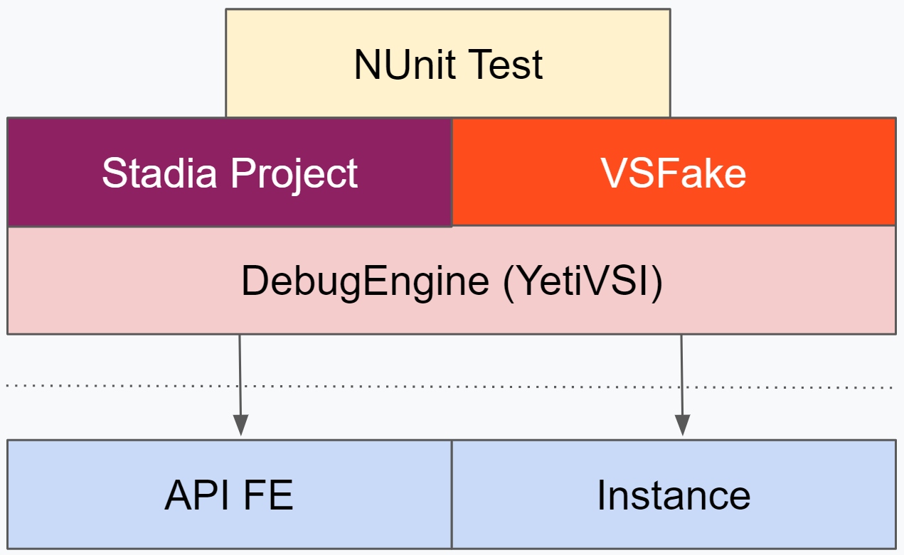
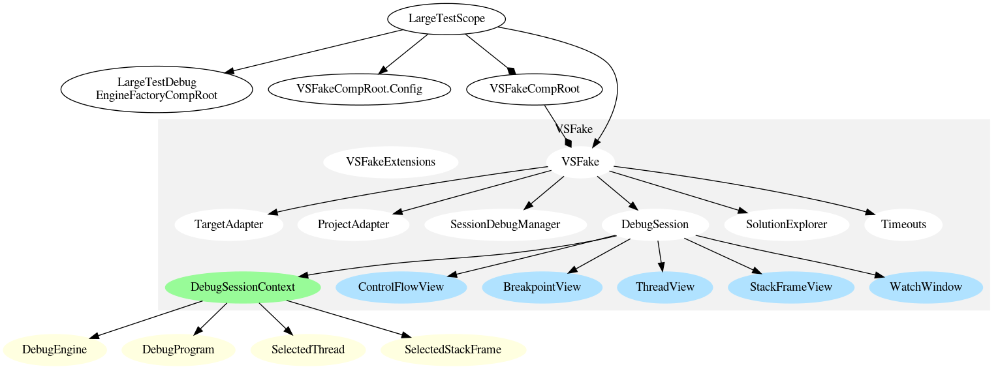
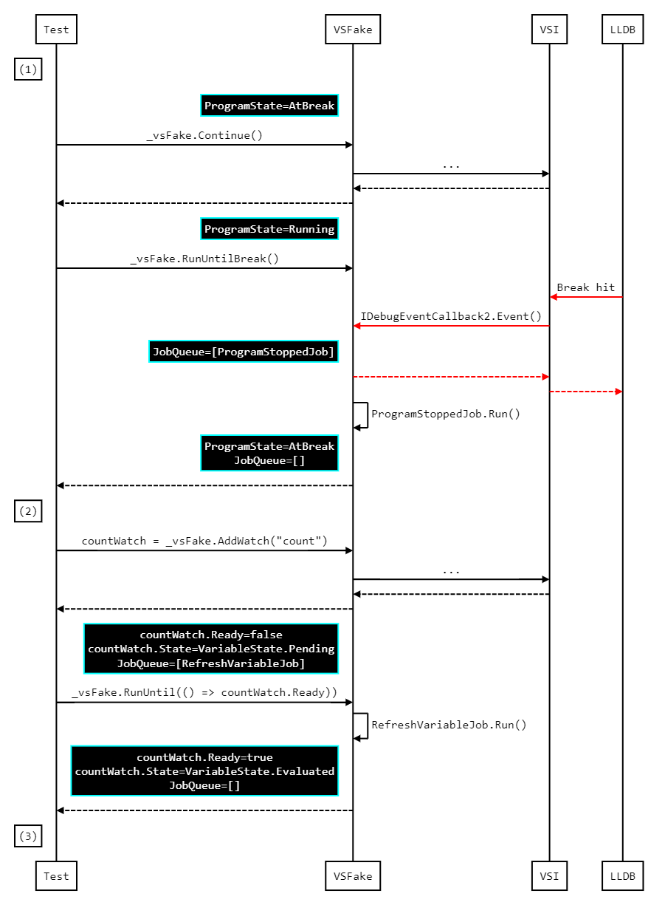

# Visual Studio Fake

[TOC]

## What is it?

A Visual Studio [**test double**]((internal)) that enables tests to be written against
the YetiVSI without the overhead of a real Visual Studio.

{width=500}

## Design

- Original design doc: [(internal)]((internal))
- Usage/handoff presentation: [(internal)]((internal))

## User Guide

### How to: Run tests

Large tests are not run by default because they are slow and require a GGP instance to be reserved.

1. Reserve a **single** instance
    - VSFake doesn't currently support environments with multiple instances reserved.
1. Select tests to run. One of:
    1. Within a test file, you can right click and select `Run Tests`.
    1. Use test traits in Visual Studio's **Test Explorer**
        1. Use a filter string like: `Trait:TestSize_Large -Trait:VSIFeature_Natvis`
        1. Or group tests by `Traits` and select desired tests

### How to: Investigate test failures

1. Look at Test Explorer's result text
1. Look at test specific log file
    - The log file name is specified in the test setup but it will be found in the general GGP logs
    directory.
    - example: `%HOMEPATH%\AppData\Roaming\GGP\logs\NatvisTestSample.20200325-13153.log`
1. Debug them
    - Timeouts are large (7 days) when a debugger is attached.

### How to: Write tests

Where are the *"things"*?
1. Stadia test project(s)
   - `YetiVSI/Visual Studio Integration/LargeTestSamples/*`
1. NUnit test
   - `YetiVSI/Visual Studio Integration/YetiVSI.LargeTests/Tests/*`
1. VSFake
   - `YetiVSI/Visual Studio Integration/VSFake/VisualStudioFake/API/*`

#### Test Anatomy - Stadia Project

- Ultimately they can look like anything
- By default, _*.natvis_ files are loaded from in the project root and its sub-directories.
- Tests place breakpoints at `// BREAK(breakpointId)` locations.

#### Test Anatomy - NUnit Test

- Should **not** be run by default
    - Apply `[Explicit]` attribute to test fixture
- Should be **selectable**
    - Apply `TestSize` and `VSIFeature` attributes to tests or test fixture
    - e.g. `[TestSize(TestSize.Large)]` and `[VSIFeature(VSIFeature.Natvis)]`
- **Close** any **Chrome** window they open
    - Use `StadiaTestWindowManager`
- Establish the **test scope**
    - The `LargeTestScope` wires together the VSFake, DebugEngine, and other miscellaneous things.
    - Should be sufficient for most/all large tests
- **Configure** the VSFake, DebugEngine, etc.
    - Stadia project name required
    - `LargeTestScope.VSFakeConfig.Timeouts`
- SetUp & TearDown
    - Many tests could **re-use** a single **debug session** &#8658; use `[OneTimeSetUp]` and
    `[OneTimeTearDown]`
- Breakpoint locator (`SampleBreakpointLocator`)
- Test methods

#### Test Anatomy - LargeTestScope / VSFake

<!--TODO/37409950) Include the source directly instead of an image.-->

**LargeTestScope**
- Contains common setup/teardown
- Contains things that do not belong in the VSFake project
    - e.g. Log initialization, JoinableTaskContext, path to MsBuild.exe

**LargeTestDebugEngineFactoryCompRoot**
- This defines the system under test, i.e. production classes and test doubles
- Should re-use as much production wire up as possible
- Prefer to configure the YetiVSI using user facing settings

**VSFakeCompRoot**
- Creates the VSFake based on configuration `VSFakeConfig` values.

**VSFake**
- Simple grab bag class that allows clients public access to the other components

**VSFake Extensions**
- Contains a lot of static convenience functions that reduce the verbosity of tests 

**TestAdapter** / **ProjectAdapter**
- Produces configurations to build and deploy the binary to the instance

**SessionDebugManager**
- Modeled on Visual Studio’s "Session Debug Manager"
- Provides API to execute VSFake job queue
- API to initiate a debug session (e.g. LaunchAndAttach)
    - Initiates and creates a DebugSession

**DebugSession**
- Abstractions for a single "debug session"
- Contains the context and "Views"

**Timeouts**
- Source for VSFake timeouts
- These can be updated dynamically

**DebugSessionContext**
- Captures the high level state of a debug session (Program, Thread, Frame)

**UI Views** (blue nodes)
- Modeled after real Visual Studio windows
- Use the DebugSessionContext as the "scope" for populating themselves (e.g. evaluating an
expression)

**DebugEngine objects** (yellow nodes)
- The references from the VSFake in to the DebugEngine being tested.

#### Test Anatomy - VSFake Control Flow

The VSFake is implemented in terms of *jobs* so that clients can **isolate "work"**.  The jobs are
executed in 1 of 2 ways:
- **Automatically** as per the method contract
    - The contract is defined by the `SyncPointAttributes` decorating the functions. e.g.
    `[SyncPoint(ExecutionSyncPoint.FRAME_SELECTED)]`
        - If clients want to disable automatic job processing they can call
        `ISessionDebugManager.StartManualMode()`.  This will disable the `SyncPoint` attributes
        and clients can process jobs using the **explicit** mechanisms described below.
- **Explicitly** by VSFake
    - e.g. Specific methods in the `ISessionDebugManager` like:
        - `RunUntilBreak(TimeSpan timeout)`
        - `RunUntil(API.ExecutionSyncPoint, TimeSpan timeout)`
        - `RunUntil(Func<bool> predicate, TimeSpan timeout)`
    - These explicit methods can be used in conjunction with
    `ISessionDebugManager.StartManualMode()` to isolate job flows, which will be especially
    useful for performance tests.

The following diagram shows the control flow to move from state 1 to state 3 described here:

**State (1)** - Stopped at breakpoint (a), no watch expressions

**State (2)** - Stopped at breakpoint (b), no watch expressions

**State (3)** - Stopped at breakpoint (b), watch expression `count, x` entered and evaluated.

Legend:
- Solid arrows indicate method invocations
- Dotted arrows indicate method returns
- Black boxes indicate relevant VSFake state
- The red arrows denote the LLDB event monitoring thread.

<!--TODO/153084699) Include the source directly instead of an image.-->

### Caveats & Limitations

- VSFake does not always reproduce Visual Studio accurately
	- The launch and attach flow performs the bare minimum steps to work
	- The Watch, Locals and Autos windows update all queried variables and children.
	  There is not concept of "visible slots" as in Visual Studio,
	  where hidden slots might not be updated.
- Stadia projects are built with MsBuild.exe
    - Path to MsBuild.exe is currently hard coded
- Test pollution
    - Instance re-used
    - Stadia process possibly re-used
- The test scope is defined by the `LargeTestDebugEngineFactoryCompRoot`.  Refer to the
implementation to understand the test doubles used and the difference between a production
environment.
    - e.g. YetiVSIPackage
- Thread switching
    - **ALL** interop objects are wrapped in a thread switching decorator
- Minimal UI views are implemented
    - No thread or stack frame views currently
- Interop methods expected to return S_OK (HResultChecker)
- Uses Sync (not Async) expression evaluation

## Owner's Guide

### Design Principles

- Make tests **As Simple As Possible**
    - Tests should be written in a Domain Specific Language (DSL) that Visual Studio **users should
    find familiar**
    - However, it should be possible to use low level (i.e. interop) API’s if desired
        - This has not been designed/implemented
- VSFake should be implemented as needed
    - Goal was to provide the architecture to enable this
- VSFake uses **"jobs"** and **"job flows"** to capture work
    - Allows clients to **isolate work**
    - Work can be isolated by a "job" unit
    - A *"job flow" is a collection of many jobs* (e.g. LaunchAndAttachFlow ⇒ LaunchAndAttachJob,
    "Bind breakpoint jobs")
        - A flow is generally required if the DebugEngine does async work
- Large tests are "slow" ⇒ be **aggressive with timeouts!**
- Be flexible, should be able to **emulate multiple Visual Studio versions**
    - Or to swap out LLDB from remote to local
- VSFake project should **not** (or minimize) dependency on anything Stadia specific.

### Caveats / Limitations

- Large Test Scope & VSFake were implemented for "**single use**" only
    - single use = one debug session
- VSFake is still being implemented on an as-needed basis.
    - Lots of missing interop calls for the launch and attach flow
- Job cancellation not supported
    - e.g. program raises Break event and eval expression jobs still in job queue
- IVariableEntry items don’t have an “expand" concept yet

### Understanding Visual Studio

- Auto generate call sequence diagrams from a real Visual Studio using
`Stadia.Debugger enable call_sequence_logger`.  See (internal) docs for more info.
    - Diagrams can be rendered with [(internal)]((internal)).
- Use `Stadia.Debugger enable parameter_logging`.

